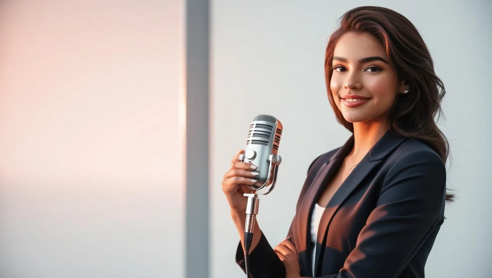

    

# Projeto Podcast Gerado por I.A.s

Projeto com o objetivo de gerar um podcast utilizando ferramentas de IA por meio de prompts mais trabalhado.

<a href="https://github.com/alehossoe/prompts-for-podcast-generate-by-ia/blob/32194c88dddae2ef4d73fa95f74af969500614bf/Podcast_Margem%20da%20Lei.mp3"> 📕Clique aqui para ler

## 💻 Tecnologias utilizadas no projeto

- [ChatGPT](https://chat.openai.com/) 
- [CANVA](https://www.canva.com/dream-lab)
- [ElevenLabs](https://beta.elevenlabs.io/)
- [Notion](https://www.notion.so/PAS-Podcast-AI-Studio-17829124cad0809abe8ccd099f26bf74/)

## ✨ Como foi feito ?

- Roteiro gerado via chatgpt
- Audio gerado pela elevenLabs
- Canva para gerar capas
- Notion para seguir template 

## 🛠️ Execução

Utilizei os prompts dentro do link do `Notion` fornecido na parte de `Materiais` para criar um podcast de maneira automatizada.

- 🤖 1. Usei os prompts de roteiro no `chagpt`
- 🤖 2. Usei os prompts de roteiro gerados pelo chatgpt no  `ElevenLabs`
- 🤖 3. Usei os prompts de artes no `canva`
